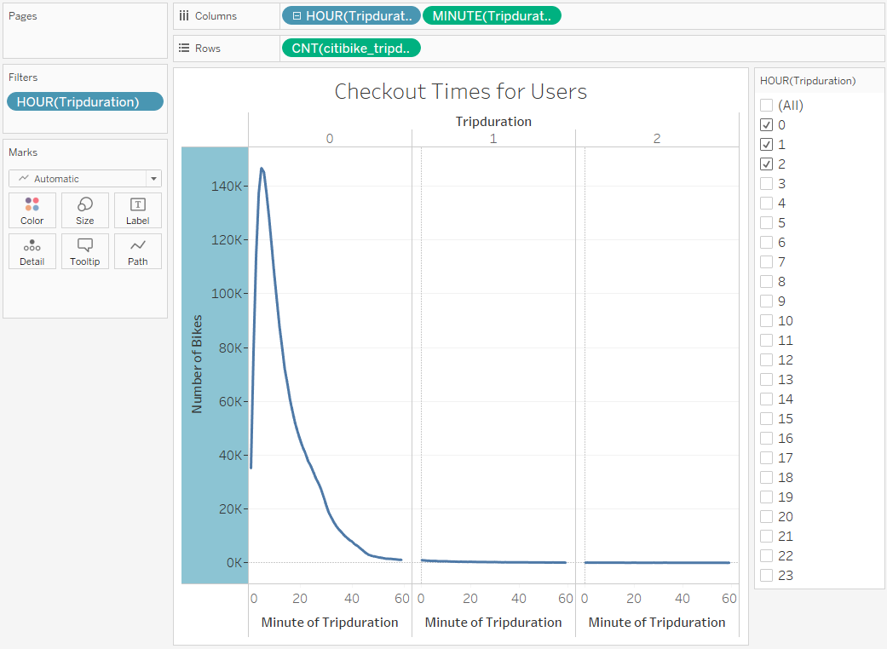
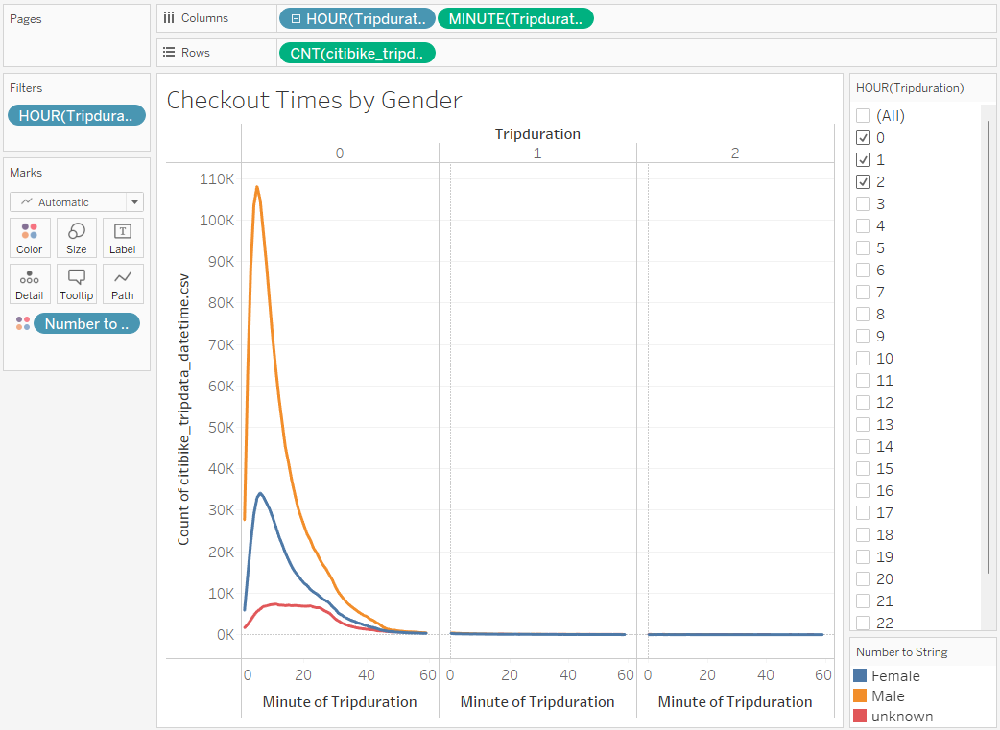
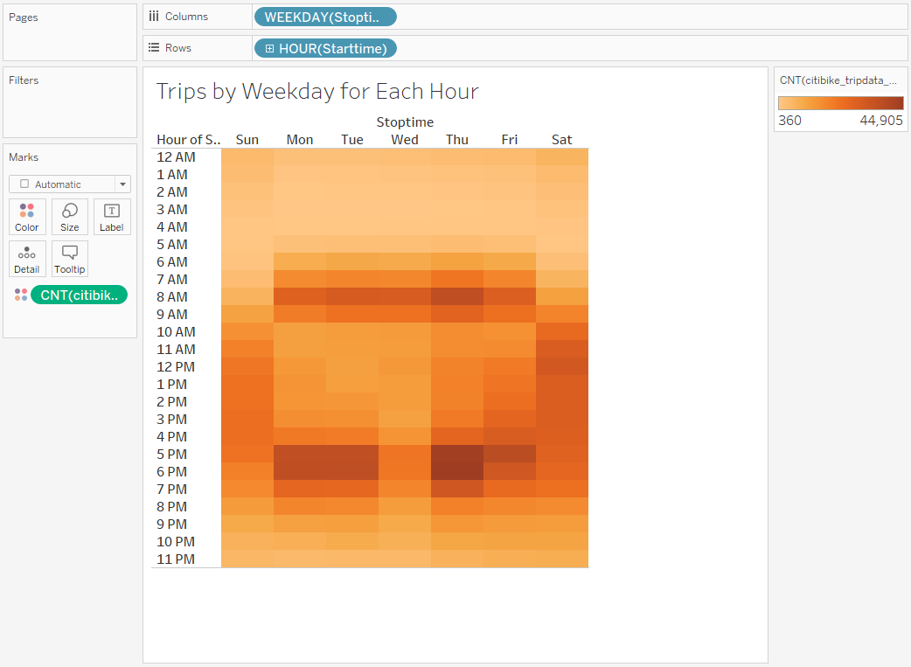
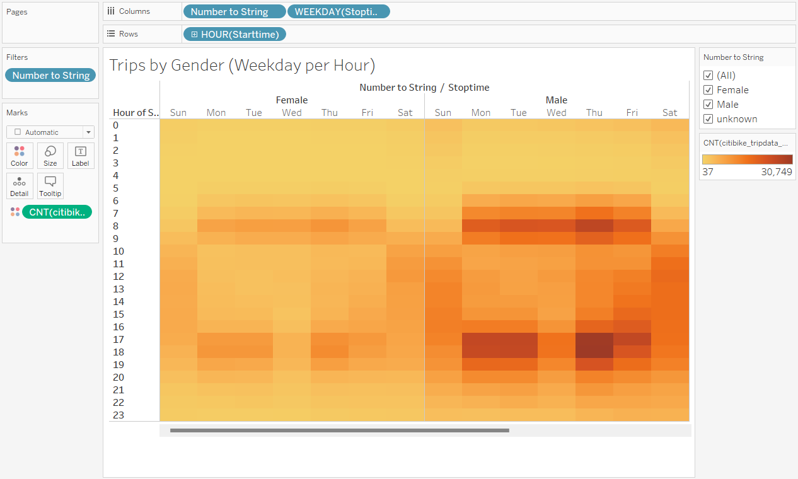
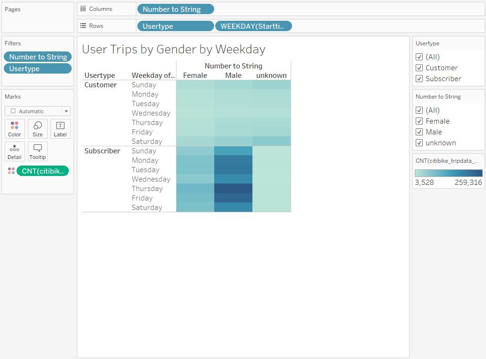
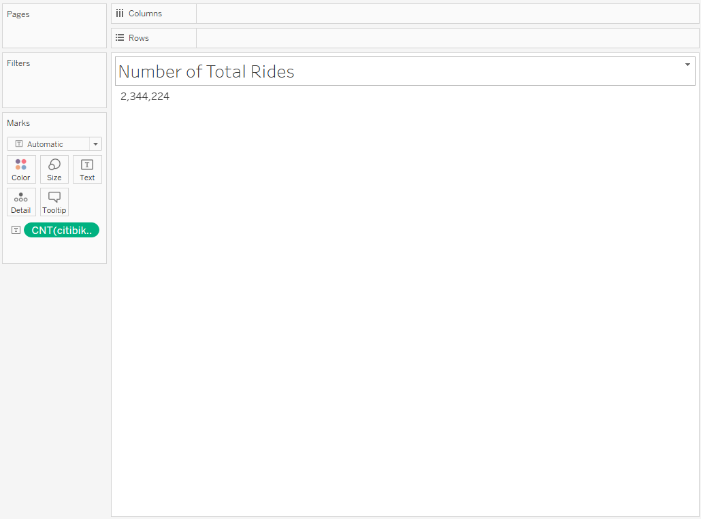
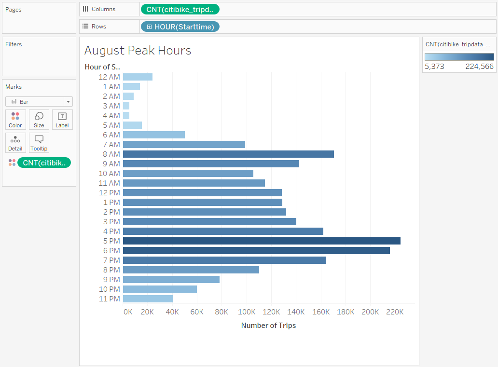

# Bikesharing Challenge

## Overview of the Analysis

## Results

* When we look for the average time that our customers use our bikes, we see it is generally for shorter trips. Most of our data comes in between 1 minute and 20 minutes, at an average of about 5 minutes per ride. Some customers will ride for up to an hour.

* Here we see the distribution of Male and Female customers by that same Trip Duration metric. There are more males than females that use Citibike and we still need to clean the data for Unknown riders. 

* This visualization helps explain the difference between customer behavior on weekdays vs. weekends. As we saw earlier, the peak hours are generally morning work hours and then after work hours, but this delves into the differences by weekdays.

* Here we wanted to see the previous breakdown of customer behavior filtered by our male vs. female customers. We can see they both use the bikes around the same time of day and day of week. 

* Here we can see that the bulk of our rides come from our subscribers. If we can focus on increasing our subscriber base, we will see rides go up overall. What types of incentives can we offer to make it most convenient for our userbase. 

* In this dataset, we were able to gather 2,344,224 rides for our Analysis. 	

* Below is a visual representation of when Citibike is busiest. We can use this data to prepare for usage and decide when would be the best time for bike repair.

## Summary

Based on our findings here we came up with a few great data points to help our investors make their decision if they are going to invest in the bike-sharing program in Des Moines. 

One of the investors wanted to see the trip duration analysis to see how long these bikes are generally rented out, which also gives some insight to how they are used. 

We found that during the weekdays many of the bike rentals in New York were used for getting to and from work. We found this based on the graphs we looked at for peak usage. On the weekend we saw a more balanced usage rate throughout the day, not concentrated around standard pre-work and post-work hours. 

Also, we found that we did have a discrepancy in male vs. female customers for Citibike and that the younger the customers are - the longer the trip duration. 

For our investors they will want to target and stock in areas with generally short trips to work, and look for areas that have a bit younger demographic as they are more likely to use them and for longer trips. 

### Additional Visualization Suggestions

* It would make sense to track the starting and ending locations based on age to see if the overall usage is higher among younger riders. 

* We can also look at just the weekend data to see how the gender breakdown looks, and the average trip durations for those days. 